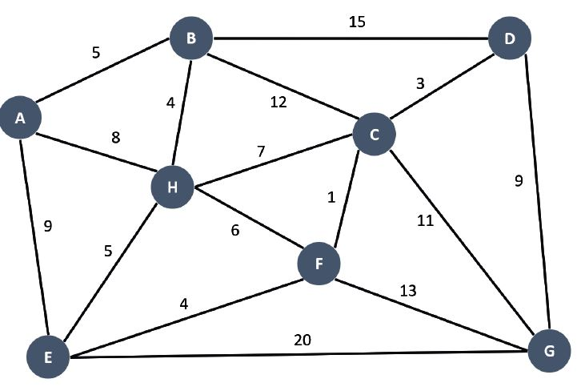

### Stepwise analysis and realization using NetworkX of - Dijkistra's Algorithm for minimum distance, Minimum spanning Tree. 

## Dijkstra's Algorithm
**Find the shortest paths between 2 individual nodes in a graph**
* Traversal from Node A to Node B is expressed through Minimum Distance Tree.

  
  
  

## Minimum Spanning Tree
**Connect the WHOLE Graph such that total distance is minimized**
* MST connects all vertices together with the minimal total weighting for Tree edges

  
  
  

