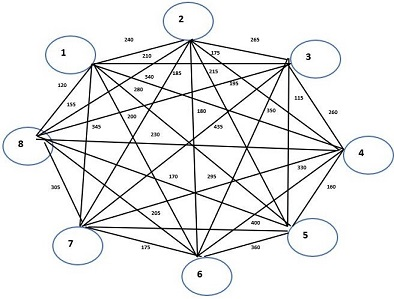

### Dijkistra's Algorithm for minimum distance, Minimum spanning Tree
`Stepwise analysis and realization using NetworkX`

## Dijkstra's Algorithm
**Find the shortest paths between 2 individual nodes in a graph**
* Traversal from Node A to Node B is expressed through Minimum Distance Tree.
<html>
<body>

  
  
  

</body>
</html>

## Minimum Spanning Tree
**Connect the WHOLE Graph such that total distance is minimized**
* MST connects all vertices together with the minimal total weighting for Tree edges
<html>
<body>

  
  
  

</body>
</html>
